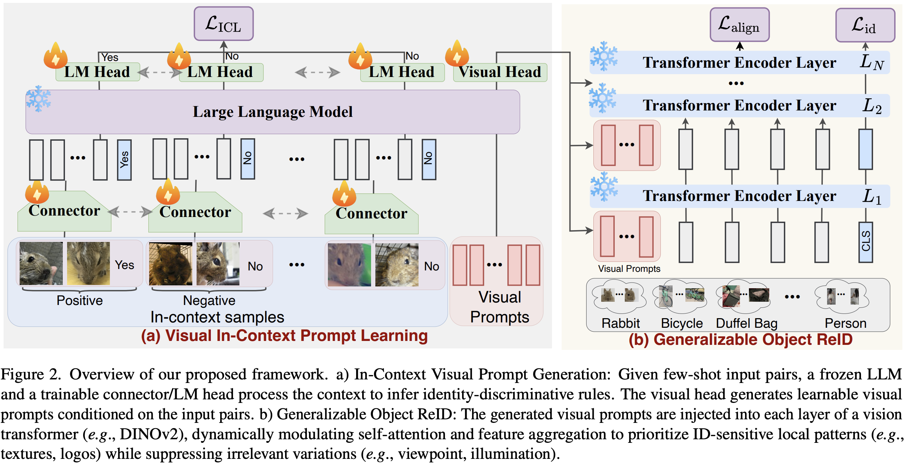

## VICP: Generalizable Object Re-Identification via Visual In-Context Prompting

This repo provides the official implementation of our VICP: Generalizable Object Re-Identification via Visual In-Context Prompting (ICCV 2025).

> VICP: Generalizable Object Re-Identification via Visual In-Context Prompting <br>
> https://arxiv.org/abs/2508.21222 <br>
> Abstract: Current object re-identification (ReID) methods train domain-specific models (e.g., for persons or vehicles), which lack generalization and demand costly labeled data for new categories. While self-supervised learning reduces annotation needs by learning instance-wise invariance, it struggles to capture \textit{identity-sensitive} features critical for ReID. This paper proposes Visual In-Context Prompting~(VICP), a novel framework where models trained on seen categories can directly generalize to unseen novel categories using only \textit{in-context examples} as prompts, without requiring parameter adaptation. VICP synergizes LLMs and vision foundation models~(VFM): LLMs infer semantic identity rules from few-shot positive/negative pairs through task-specific prompting, which then guides a VFM (\eg, DINO) to extract ID-discriminative features via \textit{dynamic visual prompts}. By aligning LLM-derived semantic concepts with the VFM's pre-trained prior, VICP enables generalization to novel categories, eliminating the need for dataset-specific retraining. To support evaluation, we introduce ShopID10K, a dataset of 10K object instances from e-commerce platforms, featuring multi-view images and cross-domain testing. Experiments on ShopID10K and diverse ReID benchmarks demonstrate that VICP outperforms baselines by a clear margin on unseen categories.

**If you found this code helps your work, do not hesitate to cite my paper or star this repo!**

### Framework


### Install requirements

```shell
pip install -r requirements.txt
```

### Training

ShopID10K dataset and checkpoints is available at: https://drive.google.com/drive/folders/1ubm0oo8-5wXLocoHIk5yt1CtzgXTg_1h?usp=sharing

training commands:

```shell
output_dir="/path/to/checkpoint/dinov2b_vpt_triple_fewshot"
python train_vpt_lora.py \
    --logging_strategy steps \
    --dataloader_drop_last True \
    --save_safetensors False \
    --ddp_find_unused_parameters False \
    --logging_steps 1 \
    --save_total_limit 10 \
    --dataloader_num_workers 16 \
    --dataloader_persistent_workers True \
    --dataloader_pin_memory False \
    --report_to wandb \
    --gradient_accumulation_steps 1 \
    --max_grad_norm 0 \
    --save_strategy steps \
    --eval_strategy steps \
    --save_steps 1000 \
    --eval_steps 20 \
    --max_steps 5000 \
    --fp16 True \
    --per_device_train_batch_size 256 \
    --dataset_name amazon \
    --lr_scheduler_type constant \
    --learning_rate 1e-4 \
    --weight_decay 0.0 \
    --cluster_index 0 \
    --output_dir ${output_dir} 
```

### Citation

If you found this code or our work useful please cite us:

```bibtex
@inproceedings{zhizhong2025vicp,
  title={VICP: Generalizable Object Re-Identification via Visual In-Context Prompting},
  author={Zhizhong, Huang and Xiaoming Liu},
  booktitle={ICCV},
  year={2025}
}
```


